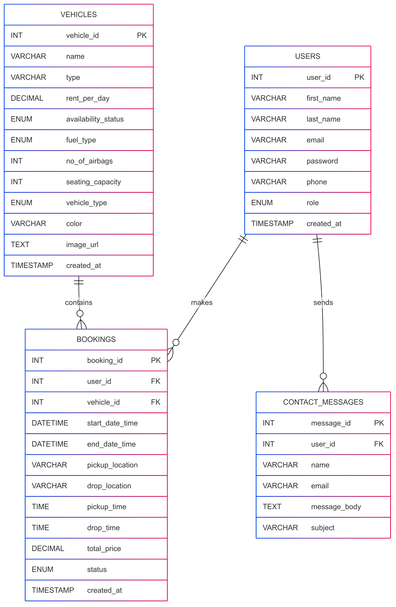

# 🚘 AutoRent - Vehicle Renting System

AutoRent is a full-stack Java web application designed to streamline the process of renting vehicles. It provides features for customers to book vehicles and for admins to manage the vehicle inventory, bookings, and users. Built using **Jakarta EE** (Servlets), **JSP**, and **MySQL**, it serves as a complete academic project for coursework submission.

---

## 📌 Project Overview

This project is part of the coursework for **CS5054NT - Advanced Programming and Technologies**. The system aims to:

- Allow customers to browse and book available vehicles
- Allow admins to manage vehicles, bookings, and contact queries
- Provide a clean and functional UI with basic frontend design
- Implement full CRUD operations for users, bookings, and vehicles

---

## 🏗️ Technologies Used

| Layer       | Tech Stack                  |
|------------|-----------------------------|
| Backend     | Java (Jakarta EE, Servlets) |
| Frontend    | HTML, CSS, JSP              |
| Database    | MySQL                       |
| Build Tool  | Maven                       |
| IDE         | IntelliJ IDEA               |

---

## 📁 Modules / Features

### 👤 User
- User registration and login
- Role-based access (admin/customer)
- Secure password storage (using BCrypt)

### 🚗 Vehicles
- Add, edit, delete vehicles (admin)
- View available vehicles (customer)
- Vehicle features: fuel type, airbags, type, color, etc.

### 📅 Booking
- Customers can book vehicles for specific dates
- Admin can view all bookings
- Pricing calculated per day
- Status handling (pending, confirmed, cancelled, completed)

### 📩 Contact Message
- Users can send queries or feedback via a contact form

---


# 🚀 How to Run the AutoRent Project Locally

This guide will walk you through setting up and running the **AutoRent - Vehicle Renting System** Java web application on your local machine.

---

## 🧱 Requirements

Before starting, make sure you have the following installed:

- ✅ **Java JDK 17 or higher**
- ✅ **Apache Tomcat 10+**
- ✅ **MySQL 8+**
- ✅ **IntelliJ IDEA (Recommended)**
- ✅ **Maven** (Bundled in IntelliJ)
- ✅ Web browser (Chrome, Firefox, etc.)

---

## 🔄 Clone the Repository

```bash
git clone https://github.com/Anmolpoudyal/vehicle_Commerce-.git
cd vehicle_Commerce-
```
## 🧰 Database Setup

1. **Create the database**:

```sql
-- Create the database if it doesn't exist
CREATE DATABASE IF NOT EXISTS vehicle_commerce;

-- Use the database
USE autorenting_db;

-- User Table
CREATE TABLE users (
    user_id INT PRIMARY KEY AUTO_INCREMENT,
    first_name VARCHAR(100),
    last_name VARCHAR(100),
    email VARCHAR(100) UNIQUE NOT NULL,
    password VARCHAR(255) NOT NULL,
    phone VARCHAR(20),
    role ENUM('admin', 'customer') DEFAULT 'customer',
    created_at TIMESTAMP DEFAULT CURRENT_TIMESTAMP
);

-- Vehicle Table
CREATE TABLE vehicles (
    vehicle_id INT PRIMARY KEY AUTO_INCREMENT,
    name VARCHAR(100),
    type VARCHAR(50),
    rent_per_day DECIMAL(10, 2),
    availability_status ENUM('available', 'rented', 'maintenance') DEFAULT 'available',
    fuel_type ENUM('petrol', 'diesel', 'electric', 'hybrid'),
    no_of_airbags INT,
    seating_capacity INT,
    vehicle_type ENUM('manual', 'automatic'),
    color VARCHAR(50),
    image_url TEXT,
    created_at TIMESTAMP DEFAULT CURRENT_TIMESTAMP
);

-- Booking Table
CREATE TABLE bookings (
    booking_id INT PRIMARY KEY AUTO_INCREMENT,
    user_id INT,
    vehicle_id INT,
    start_date_time DATETIME,
    end_date_time DATETIME,
    pickup_location VARCHAR(255),
    drop_location VARCHAR(255),
    pickup_time TIME,
    drop_time TIME,
    total_price DECIMAL(10, 2),
    status ENUM('pending', 'confirmed', 'cancelled', 'completed') DEFAULT 'pending',
    created_at TIMESTAMP DEFAULT CURRENT_TIMESTAMP,
    FOREIGN KEY (user_id) REFERENCES users(user_id),
    FOREIGN KEY (vehicle_id) REFERENCES vehicles(vehicle_id)
);

-- Contact Message Table
CREATE TABLE contact_messages (
    message_id INT PRIMARY KEY AUTO_INCREMENT,
    name VARCHAR(100),
    email VARCHAR(100),
    message_body TEXT,
    subject VARCHAR(255)
);
```
## 📊 Entity Relationship Diagram (ERD)



## ✔️✔️ Live Frontend Preview ✔️✔️

This is a static preview. Backend functionalities like booking, login, and database interactions won't work here. 

[👉 Click here to view the live frontend](https://bidur7745.github.io/-AutoRent-Vehicle-Renting-System/)